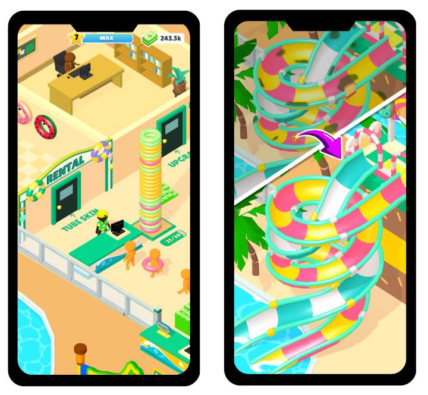
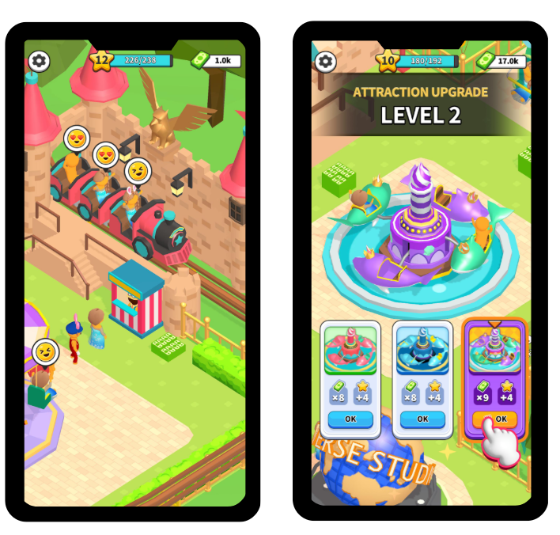
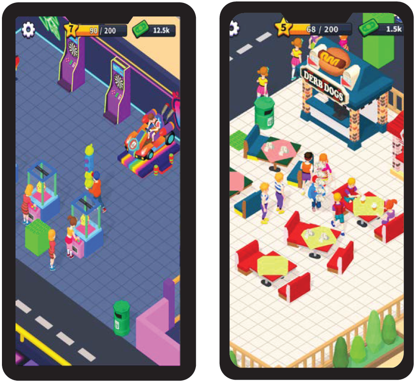
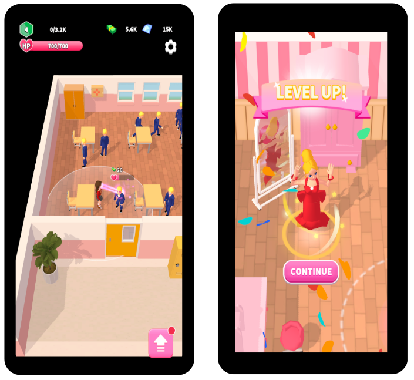

# 🎮 이수민 | Game Programmer 

> 상용 게임 클라이언트 및 코어 로직 개발 경험을 기반으로  
> 액션 게임의 전투 시스템, AI, 게임플레이 구조 구현에 집중하는 프로그래머입니다.

📧 Email: lsm6265@naver.com  

# 👋 About Me

> 상용 모바일 게임 클라이언트 및 코어 로직 개발 경험을 가진 프로그래머입니다.  
> Unity 실무 경험을 기반으로 Unreal Engine 5에서 액션 전투 시스템과 AI 구조 설계에 집중하고 있습니다.  
> 특히 액션 RPG 장르의 전투 구조와 플레이 감각 구현에 관심이 있으며,  
> 완성도 높은 게임플레이 경험을 만드는 개발자가 되는 것을 목표로 하고 있습니다.

## 🧱 Tech Stack

### 🎮 Engine
 

### 💻 Language
 

### 🧠 Gameplay & Systems
   

### 🛠 Tools
  

---
# ⚔️ Unreal Project (Action RPG Project)

>GAS 기반 전투 아키텍처를 설계하고   
>Ability + Data 중심 확장 구조를 검증한 3D 액션 프로젝트

>Lies of P 전투 구조를 레퍼런스로,   
>싱글 플레이 환경에서 전투·AI·데이터 흐름을 통합 설계했습니다.

> • 기간: 2025.07 ~ 2025.09  
> • 엔진: Unreal Engine 5.4.4 (C++ / Blueprint)  
> • 중점: Combat System / AI / Gameplay Architecture
> 
• Repository : [GitHub 포트폴리오 링크](https://github.com/HaloTwo/LOP)  
• Video : [Youtube 영상 링크](https://youtu.be/6_0rvUXyf8w)  

## 🔧 Core Implementation
- Gameplay Ability System(GAS) 기반 전투 시스템 설계  
- Weapon Trace 기반 정밀 공격 판정 처리  
- Target Lock-On 시스템 구현  
- Behavior Tree + EQS 기반 적 AI 설계  
- Boss Phase 패턴 전환 시스템 구현  
- Motion Warping + Anim Notify 기반 전투 연출 처리  
- DataAsset 기반 무기 / 스킬 데이터 구조 설계  
---

# 💼 Experience

## ALBUS Corp | Unity Client Programmer  

> 2023.09 ~ 2025.03 (1년 6개월)   
> 유니티 클라이언트 개발자  
> 상용 모바일 게임 4종 출시 참여

### 👤 Role
- 코어 게임 루프 설계 및 구현 담당
- 저장 시스템 및 데이터 구조 설계 주도
- 100명 이상 NPC 동시 처리 구조 설계 및 최적화
- Google Sheet 기반 데이터 파이프라인 구축

---

### 🎮 Released Games

- 🏝 WaterParkBoys  
  📱 [Google Play](https://play.google.com/store/apps/details?id=com.Albus.WaterParkBoys) | 🍎 [App Store](https://apps.apple.com/us/app/waterpark-boys/id6457257165)

  

  
📷이미지 펼치기/닫기

  

  

- 🎡 AwesomePark : Idle Game  
  📱 [Google Play](https://play.google.com/store/apps/details?id=com.Albus.AwesomePark) | 🍎 [App Store](https://apps.apple.com/kr/app/awesome-park-idle-game/id6482050793)

  

  
📷이미지 펼치기/닫기

  

  

- 🛼 Skate Shop: Roller Disco Dance  
  📱 [Google Play](https://play.google.com/store/apps/details?id=com.albus.newrollerdisco) | 🍎 [App Store](https://apps.apple.com/us/app/skate-shop-roller-disco-dance/id6744957869)

  

  
📷이미지 펼치기/닫기

  

  

- 👑 MakeAQueen  
  📱 [Google Play](https://play.google.com/store/apps/details?id=com.Albus.MakeAQueens)

  

  
📷이미지 펼치기/닫기

  

  

---

### 🔧 Core Contributions

#### 🎮 Gameplay Architecture
- NPC 이동 및 행동 패턴 로직 구현
- 이벤트 트리거 기반 상호작용 시스템 개발
- Delegate 기반 이벤트 구조로 시스템 간 결합도 감소

#### 💾 Save System
- 암호화 JSON 기반 저장 구조 설계
- 데이터 버전 관리 및 포맷 변경 대응 로직 구현
- 진행 상태 기준 저장 데이터 정합성 검증 및 보정 처리

>안정적으로 데이터를 유지하는 것을 우선으로 설계했습니다.

#### ⏱ Offline Progression
- 마지막 접속 시간 기반 오프라인 보상 계산 로직 구현
- 건물 생산 구조와 연동된 누적 보상 처리

>장시간 미접속 상황에서도 데이터가 자연스럽게 이어지도록 구성했습니다.

#### ⚡ Large Scale NPC & Optimization
- 100명 이상 손님 NPC 동시 동작 환경 고려
- 상태 기반 동적 컴포넌트 부착 구조 구현
- Component Pool 적용 및 GC 부담 완화
- GC 부담 완화 및 프레임 안정화

>실제 플레이 상황에서 성능 저하가 발생하지 않도록 설계했습니다.

### 🎮 Gameplay Interaction
- 손님 NPC 전용 탑승 시스템을 플레이어 상호작용으로 확장
- 탑승 상태 전환 로직 구현
- 카메라 View Mode 전환 처리

>기존 시스템을 재사용하는 방향으로 구조를 확장했습니다.

#### 🛠 Data Pipeline Tooling
- Google Sheet 데이터를 ScriptableObject로 변환하는 에디터 툴 제작
- 데이터 변경 시 자동 갱신 구조 구성

>기획자가 코드 수정 없이 밸런스를 조정할 수 있도록 파이프라인을 구성했습니다.

---

# 🎮 Projects

> 상세 구현 내용 및 코드 구조는 각 GitHub Repository에서 확인 가능합니다.  
> (※ 시스템/전투 중심 구현 프로젝트)

## 🐉 Pokemon: Scarlet (Personal Project)

> 상태 패턴 기반 AI 및 게임 시스템 구조 설계 프로젝트  
>
> • 기간: 2023.06 ~ 2023.07  
> • 환경: Unity3D, C#, Github
> 
• Repository : [GitHub 포트폴리오 링크](https://github.com/HaloTwo/Pokemon)  
• Video : [Youtube 영상 링크](https://www.youtube.com/watch?v=s__GzKLjPf0)  

## 🤖 Nier: Automata (Team Project)

> Enemy AI, Boss 패턴, 전투 시스템 구현 중심 3D 액션 프로젝트  
>
> • 기간: 2023.05 ~ 2023.06  
> • 환경: Unity3D, C#, Github  
> • 역할: Enemy AI, Boss 패턴, 전투 시스템 구현
>  
• Repository : [GitHub 포트폴리오 링크](https://github.com/HaloTwo/Nier-Automata)  
• Video : [Youtube 영상 링크](https://youtu.be/h8MQ959f8tk)  

## 🧁 Cuphead (Personal Project)

> 보스 패턴 기반 2D 액션 전투 시스템 구현 프로젝트  
>
> • 기간: 2023.04 ~ 2023.04  
> • 환경: Unity2D, C#, Github
> 
• Repository : [GitHub 포트폴리오 링크](https://github.com/HaloTwo/Cuphead)  
• Video : [Youtube 영상 링크](https://youtu.be/5bR0k2nC6nk)  

---

# 🎓 Education & Training

- 경일게임아카데미 Unity 게임 프로그래밍 양성과정 수료  
  (2023.03 ~ 2023.08)

- 한림대학교 소프트웨어융합스쿨 콘텐츠IT학과 졸업  
  (2019.03 ~ 2023.02)

- 한림성심대학교 디지털미디어콘텐츠과 졸업  
  (2017.03 ~ 2019.02)
