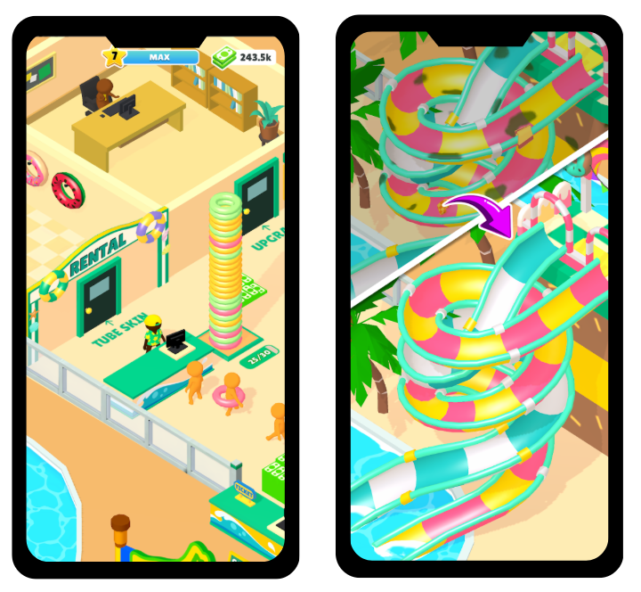
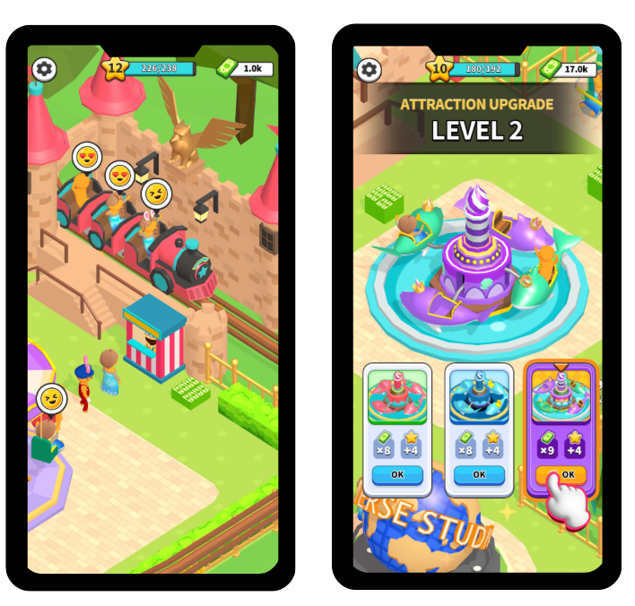
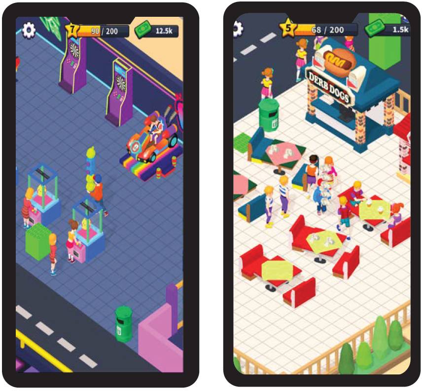
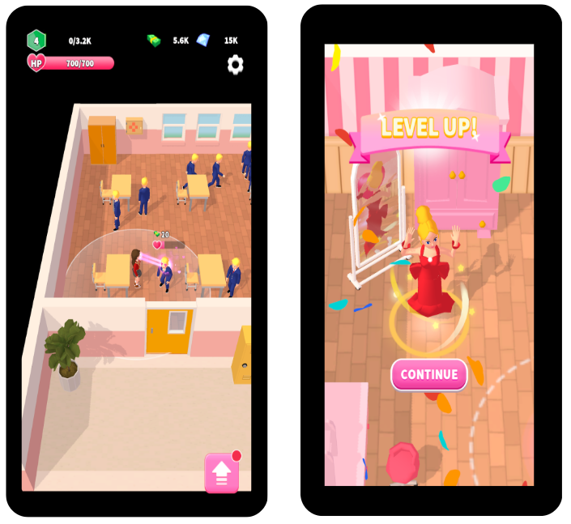

# 이수민 | Game Programmer 

## 👋 About Me
> Unity를 사용한 상용 게임 개발 경험과 Unreal Engine 기반 프로젝트 경험을 바탕으로  
> 게임플레이 시스템 전반을 구현하며, 특히 전투 구조와 상호작용 설계에 강점을 가진 프로그래머입니다.

> 원활한 소통과 협업을 바탕으로 팀의 완성도를 함께 높이는 개발자를 지향하며,  
> 새로운 개발 도구와 AI 기반 보조 도구를 적극적으로 활용해 개발 생산성을 높이고 있습니다.

📧 Email: lsm6265@naver.com

## 🧱 기술 스택

### 🎮 Engine
 

### 💻 Language
 

### 🧠 Gameplay & Systems
   

### 🛠 Tools
  

---

# 💼 경력

## ALBUS Corp | 유니티 클라이언트 개발자
> 2023.09 ~ 2025.03 (1년 6개월)

> Unity 기반 모바일 하이퍼캐주얼 게임 4종 출시 참여  
> 초기 개발부터 런칭 및 유지보수까지 전 과정 참여  
> 게임플레이, UI, 데이터 구조, 최적화, SDK 연동 등 클라이언트 전반 개발 담당  

### 👤 주요 담당 업무
- 코어 게임 루프 설계 및 구현  
- NPC 이동, 행동 패턴, 상호작용 시스템 구현  
- UGUI 기반 인게임 UI 및 팝업 UI 구현  
- 저장 시스템 및 데이터 구조 설계  
- UniTask 및 async/await 기반 비동기 처리 구조 구현  
- 100명 이상 NPC 동시 처리 구조 설계 및 최적화  
- LOD, Occlusion Culling, Object Pool, Component Pool 기반 최적화 적용  
- Google Sheet 기반 데이터 파이프라인 구축  
- Firebase 및 외부 SDK 연동을 통한 데이터 수집, 광고, 서비스 기능 구현  
- 플랫폼별 SDK 설정 및 연동 이슈 대응  

<strong>🔍 구현 상세 및 기술적 접근 방식 보기</strong>

### 🎮 게임플레이
- NPC 이동 및 행동 패턴 로직 구현  
- 이벤트 트리거 기반 상호작용 시스템 설계  
- Delegate 기반 구조로 시스템 간 결합도 감소  
- 탑승, 생산, 보상 등 게임 루프와 연결되는 상호작용 기능 구현  

### 🖥 UI 구현
- UGUI 기반 인게임 UI 및 팝업 UI 구현  
- 재화, 보상, 업그레이드, 진행 상태 표시 UI 구현  
- 게임 상태 변화에 따라 UI가 갱신되도록 이벤트 기반 구조 적용  

### 💾 저장 시스템
- 암호화 JSON 기반 저장 구조 설계  
- 데이터 버전 관리 및 포맷 변경 대응  
- 데이터 정합성 검증 및 보정 처리  

### ⏱ 비동기 처리 및 오프라인 보상
- UniTask 및 async/await 기반 비동기 초기화 흐름 구현  
- 마지막 접속 시간 기반 오프라인 보상 계산 로직 구현  
- 건물 생산 구조와 연동된 누적 보상 처리  
- 저장 데이터, 보상 계산, UI 갱신 흐름이 순차적으로 처리되도록 구성  

### ⚡ 최적화
- 100명 이상 NPC 동시 처리 구조 설계  
- Object Pool 및 Component Pool 적용으로 반복 생성 비용과 GC 부담 완화  
- LOD, Occlusion Culling을 활용한 3D 씬 렌더링 최적화 적용  
- 불필요한 Update 호출 및 컴포넌트 활성화 비용 감소  
- 프레임 드랍 구간 분석 및 프레임 안정화 처리  

### 🛠 데이터 파이프라인
- Google Sheet → ScriptableObject 변환 자동화 툴 제작  
- 데이터 변경 시 자동 반영 구조 구축  
- 기획 데이터 수정 후 코드 변경 없이 밸런스 조정이 가능하도록 구성  

### 📊 SDK / 데이터 분석 / 외부 연동
- Firebase 기반 사용자 행동 데이터 수집 및 분석 환경 구축  
- 광고 및 외부 SDK 연동을 통한 서비스 기능 구현  
- 플랫폼별 SDK 설정 및 연동 이슈 대응  
- 로그 기반 데이터 확인 및 게임 밸런스 개선에 활용  

### 🚀 빌드 및 배포
- Android / iOS 빌드 대응  
- Google Play 및 App Store 출시 과정에서 빌드 이슈 대응  
- SDK 설정, 권한, 플랫폼별 설정값 관리  

### 🤖 개발 효율 개선
- 반복적인 코드 작성 및 문서 정리 자동화 방식 도입  
- 작업 흐름 개선을 통한 개발 속도 및 생산성 향상  
- 새로운 도구를 빠르게 학습하고 적용하여 반복 작업 최소화  

---

# 🎮 프로젝트

## 💼 회사 프로젝트

> Unity 기반 모바일 하이퍼캐주얼 게임 4종을 초기 개발부터 런칭 및 유지보수까지 전 과정 참여  
> 게임플레이, 데이터 구조, 최적화 등 클라이언트 전반 개발 담당  
> Firebase 및 외부 SDK 연동(Analytics, 광고, 데이터 수집), 빌드 및 배포 프로세스 관리 경험

### 📱 출시 게임

| 썸네일 | 게임명 | 장르 | Google Play | App Store |
|--------|--------|------|-------------|-----------|
|  | WaterParkBoys | Hyper Casual / Simulation | [바로가기](https://play.google.com/store/apps/details?id=com.Albus.WaterParkBoys) | [바로가기](https://apps.apple.com/us/app/waterpark-boys/id6457257165) |
|  | AwesomePark | Hyper Casual / Simulation | [바로가기](https://play.google.com/store/apps/details?id=com.Albus.AwesomePark) | [바로가기](https://apps.apple.com/kr/app/awesome-park-idle-game/id6482050793) |
|  | Roller Disco | Hyper Casual / Simulation | [바로가기](https://play.google.com/store/apps/details?id=com.albus.newrollerdisco) | [바로가기](https://apps.apple.com/us/app/skate-shop-roller-disco-dance/id6744957869) |
|  | MakeAQueen | Hyper Casual / Action | [바로가기](https://play.google.com/store/apps/details?id=com.Albus.MakeAQueens) | - |

## 🧩 개인 프로젝트

### 🎮 프로젝트 요약

| 프로젝트 | 엔진 | 장르 | 핵심 구현 | 링크 |
|----------|------|------|-----------|------|
| Project MORPG (개발 중) | Unity 6 | 3D MORPG | C++ TCP 서버 · MariaDB · 캐릭터 영속화 · 위치 동기화 | [GitHub](https://github.com/HaloTwo/Project_MORPG) |
| Lies of P | Unreal 5 | 3D 액션 RPG | GAS · Weapon Trace · Lock-On · BT/EQS AI | [GitHub](https://github.com/HaloTwo/LOP) / [영상](https://youtu.be/6_0rvUXyf8w) |
| WildTamer | Unity 6 | 2D RPG | 커스텀 군집 AI · 자동 전투 · Shader Fog | [GitHub](https://github.com/HaloTwo/WildTamer) / [영상](https://youtube.com/shorts/mLd9Y7k4bvM) |
| Pokemon: Scarlet | Unity | 3D 턴제 RPG | State Pattern · Enemy AI · 데이터 구조 · 턴제 전투 | [GitHub](https://github.com/HaloTwo/Pokemon) / [영상](https://www.youtube.com/watch?v=s__GzKLjPf0) |
| Nier:Automata | Unity | 3D 액션 RPG | Enemy AI · Boss 패턴 · 전투 처리 · Phase 전환 | [GitHub](https://github.com/HaloTwo/Nier-Automata) / [영상](https://www.youtube.com/watch?v=h8MQ959f8tk) |
| Cuphead | Unity | 2D 액션 | Boss 패턴 · Coroutine · Projectile | [GitHub](https://github.com/HaloTwo/Cuphead) / [영상](https://www.youtube.com/watch?v=5bR0k2nC6nk) |

<strong>🔍 주요 프로젝트 상세 보기</strong>

---

### 🔹 Project MORPG (Unity 6, 진행 중)

> Unity 6 기반 3D 쿼터뷰 MORPG 프로젝트입니다.  
> Unity 클라이언트가 계정/캐릭터 데이터를 직접 판단하지 않고,  
> **C++ TCP 서버가 로그인, 회원가입, 캐릭터 생성/삭제, 게임 입장, 원격 플레이어 동기화 흐름을 처리하고 MariaDB에 영구 데이터를 저장하는 구조**로 구현하고 있습니다.

> 현재는 온라인 RPG의 기본 흐름인  
> **계정 인증 → 캐릭터 슬롯 → 캐릭터 생성/삭제 → 게임 입장 → 원격 플레이어 위치 동기화**까지 구현했습니다.  
> 이후 인벤토리, 장비, 전투, 스킬 사용 구조를 서버 검증 방식으로 확장할 예정입니다.

- **기간:** 2026.05.01 ~ 진행 중
- **기술:** Unity 6 · C# · C++17 · Winsock TCP Server · MariaDB · DBeaver · Codex
- **목표:** Unity 클라이언트와 C++ TCP 서버를 분리한 서버 중심 MORPG 구조 설계
- **확장 목표:** 인벤토리 / 장비 / 전투 / 스킬 사용 흐름을 서버 검증 구조로 확장

#### 🔧 현재 구현

- LoginScene → LoadingScene → CharacterSelectScene → GameScene 흐름 구성
- Unity TCP Client와 C++ Winsock TCP Server 연결
- 텍스트 프로토콜 기반 요청/응답 패킷 처리
- NetworkManager, TcpServerConnection, ServerTextProtocol, PacketDispatcher 구조 분리
- C++ 서버의 TcpServer, ClientSession, PacketCodec, AuthService 구조 구현
- Repository Pattern 기반 MariaDB 접근 구조 구성
- 로그인 / 회원가입 / 캐릭터 생성 / 캐릭터 삭제 / 게임 입장 흐름 서버 처리
- 비밀번호 SHA-256 해시 저장 및 기존 평문 테스트 계정 마이그레이션
- 계정당 캐릭터 3슬롯 구조와 `slot_index` 기반 슬롯 유지 처리
- 캐릭터 이름 입력 및 클라이언트/서버 양쪽 검증
- 두 클라이언트 접속 시 원격 플레이어 Spawn / Move / Stop / Despawn 동기화
- 원격 플레이어 위치 보간 및 Move 패킷 기반 복구 생성
- 인게임 채팅 UI와 TCP 채팅 송수신 흐름 구현
- 서버 미실행 또는 연결 끊김 시 종료 팝업 처리

#### 📌 구현 의도

- Unity 클라이언트가 DB에 직접 접근하지 않고, 계정/캐릭터 관련 요청은 C++ 서버를 통해 처리하도록 분리했습니다.
- 클라이언트는 입력, UI, 연출, 패킷 송수신을 담당하고, 서버는 계정 검증, 캐릭터 생성/삭제, 입장 가능 여부, 원격 플레이어 상태 전달을 담당합니다.
- DB에는 계정, 캐릭터 슬롯, 직업, 위치, 기본 스킬처럼 다시 접속해도 유지되어야 하는 데이터를 저장합니다.
- 캐릭터 슬롯은 `slot_index` 기준으로 관리하여 중간 슬롯을 삭제해도 다른 슬롯 위치가 밀리지 않도록 구성했습니다.
- 초기 구현은 Blocking TCP와 Text Protocol로 시작했지만, 네트워크 연결, 패킷 변환, 서비스 계층, Repository 계층을 분리해 추후 IOCP / Binary Packet 구조로 확장할 수 있도록 설계했습니다.

---

### 🔹 Lies of P (Unreal 5)

> UE5 / GAS 기반 3D 액션 RPG 개인 프로젝트  
> 전투 판정, 타겟팅, AI 패턴, 데이터 구조를 중심으로 액션 게임의 전투 흐름을 구현했습니다.

- **기간:** 2025.07 ~ 2025.09  
- **기술:** Unreal Engine 5 · C++ · Blueprint · GAS · Behavior Tree · EQS  

#### 🔧 주요 구현
- Gameplay Ability System 기반 Ability / Effect / Attribute / Tag 구조 설계
- Ability 단위로 공격, 회피, 락온, 피격 등 전투 기능 분리
- Weapon Trace 기반 공격 판정 구현
- 빠른 공격 모션에서도 프레임 누락을 줄이기 위해 이전 위치와 현재 위치 사이를 Trace하는 방식 적용
- Lock-On 타겟 탐색, 카메라 보정, 락온 상태 전용 이동 처리 구현
- Behavior Tree + EQS 기반 적 탐색 및 전투 AI 구현
- Boss HP 조건에 따른 Phase 전환 및 패턴 분리 구조 구현
- Motion Warping과 Anim Notify를 활용한 공격 이동 보정 및 전투 타이밍 제어
- DataAsset 기반 무기 / 스킬 / 패턴 데이터 구조 설계

#### 📌 구현 의도
- 기능을 하드코딩하지 않고 Ability, GameplayTag, DataAsset 중심으로 분리하여 확장 가능한 구조를 목표로 구현했습니다.
- 새로운 무기, 공격 패턴, AI 패턴을 추가할 때 기존 코드를 크게 수정하지 않고 데이터와 Ability 추가로 확장할 수 있도록 구성했습니다.

---

### 🔹 WildTamer Prototype (Unity 2D)

> WildTamer 스타일의 2D 군집 기반 테이밍 RPG 프로토타입  
> 다수의 아군 유닛이 플레이어를 따라다니며 자동 전투를 수행하는 구조를 구현했습니다.

- **기간:** 2026.03.05 ~ 2026.03.09  
- **기술:** Unity 2D · C#  

#### 🔧 주요 구현
- 플레이어를 중심으로 한 부대 유닛 이동 및 간격 유지 로직 구현
- 다수 유닛이 서로 겹치지 않도록 위치 보정 및 추적 로직 처리
- 적 탐색, 타겟 선택, 자동 공격 흐름 구현
- 아군 / 적 유닛의 상태 기반 행동 처리
- Object Pool 기반 유닛 및 이펙트 재사용 구조 적용
- 전투 중 유닛 생성 / 제거가 반복되는 상황에서 Instantiate / Destroy 사용을 줄이도록 구성

#### 📌 구현 의도
- 짧은 기간 안에 핵심 전투 루프를 검증하기 위해 이동, 탐색, 공격, 풀링 구조를 우선 구현했습니다.
- 단순한 자동 전투가 아니라 다수 유닛이 동시에 움직이는 상황에서 충돌감과 간격 유지가 자연스럽게 보이도록 구성했습니다.

---

### 🔹 Pokemon: Scarlet (Unity 3D)

> Pokemon 스타일의 3D RPG 모작 프로젝트  
> 턴제 전투, 캐릭터 상태 관리, 인벤토리 및 데이터 기반 시스템 구현에 중점을 둔 프로젝트입니다.

- **기간:** 2023.06 ~ 2023.07  
- **기술:** Unity 3D · C#  

#### 🔧 주요 구현
- State Pattern 기반 캐릭터 / AI 상태 전이 구조 설계
- 탐색, 이동, 전투 진입, 공격 선택 등 상태별 로직 분리
- 턴제 전투 흐름 구현
- 인벤토리, 상점, 아이템 사용 등 RPG 기본 시스템 구현
- ScriptableObject + Json 기반 데이터 관리 구조 설계
- Object Pool을 활용한 반복 생성 오브젝트 관리
- LOD, Occlusion Culling 등을 활용한 씬 최적화 적용

#### 📌 구현 의도
- 캐릭터와 AI의 행동을 상태 단위로 분리하여 전투와 필드 로직이 섞이지 않도록 구성했습니다.
- 아이템, 상점, 전투 데이터 등을 데이터 기반으로 관리하여 기능 추가와 밸런스 수정이 쉽도록 설계했습니다.

---

### 🔹 Nier: Automata (Unity 3D, Team Project)

> 3D 액션 전투 중심 팀 프로젝트  
> Enemy AI, Boss 패턴, 공격 / 피격 상호작용 등 전투 흐름 구현을 담당했습니다.

- **기간:** 2023.05 ~ 2023.06  
- **기술:** Unity 3D · C#  
- **역할:** Enemy AI · Boss Pattern · Combat Interaction 구현

#### 🔧 주요 구현
- Enemy AI 상태 머신 기반 행동 로직 구현
- 적의 추적, 공격, 대기, 피격 상태 전환 처리
- Boss 패턴 설계 및 패턴 실행 흐름 구현
- 공격 / 피격 / 경직 등 전투 상호작용 처리
- Object Pool 기반 투사체 및 전투 오브젝트 최적화
- 팀 프로젝트 내 전투 담당 파트 구현 및 연동

#### 📌 구현 의도
- 적 AI와 보스 패턴을 상태 단위로 분리하여 패턴 추가 및 수정이 쉽도록 구성했습니다.
- 플레이어 공격과 적 피격 반응이 자연스럽게 이어지도록 전투 상호작용 흐름을 중심으로 구현했습니다.

---

### 🔹 Cuphead (Unity 2D)

> Cuphead 스타일의 2D 보스전 모작 프로젝트  
> 보스 패턴, 타이밍 기반 공격, 전투 연출 흐름 구현에 중점을 둔 프로젝트입니다.

- **기간:** 2023.04 ~ 2023.04  
- **기술:** Unity 2D · C#  

#### 🔧 주요 구현
- 보스 패턴 기반 전투 시스템 설계 및 구현
- Coroutine 기반 패턴 순서 및 공격 타이밍 제어
- 투사체, 이펙트 등 반복 생성 오브젝트에 Object Pool 적용
- Scene Async Loading을 활용한 씬 전환 처리
- 카메라 이동 및 전투 연출 처리
- 플레이어 공격 / 피격 / 회피 흐름 구현

#### 📌 구현 의도
- 보스전의 핵심인 패턴 반복, 타이밍, 회피 흐름을 중심으로 구현했습니다.
- Coroutine을 활용해 패턴 순서를 제어하고, Object Pool을 적용해 전투 중 반복 생성 비용을 줄였습니다.

# 🎓 학력 및 교육

- 경일게임아카데미 Unity 게임 프로그래밍 양성과정 수료  
  (2023.03 ~ 2023.08)

- 한림대학교 소프트웨어융합스쿨 콘텐츠IT학과 졸업  
  (2019.03 ~ 2023.02)

- 한림성심대학교 디지털미디어콘텐츠과 졸업  
  (2017.03 ~ 2019.02)
