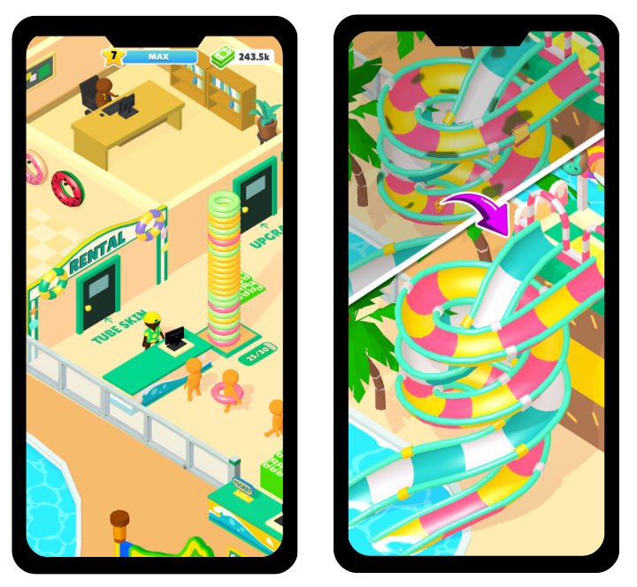
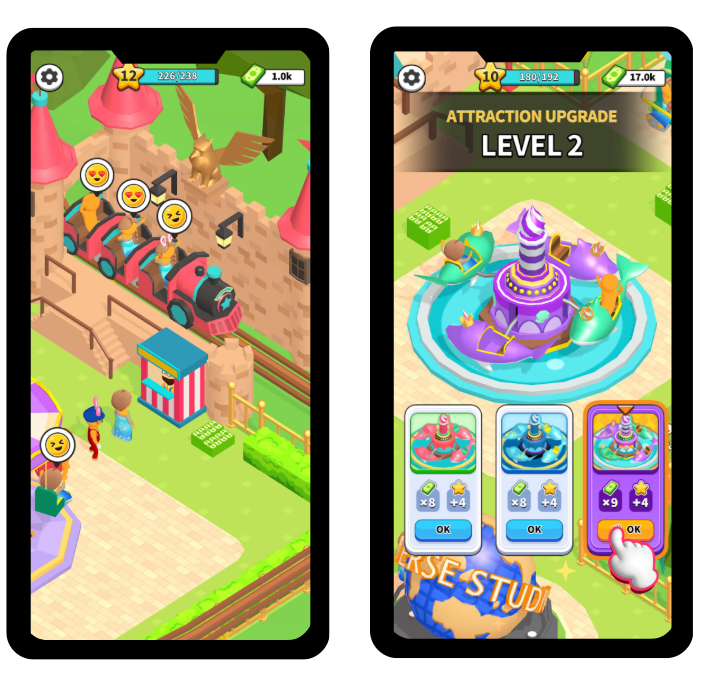
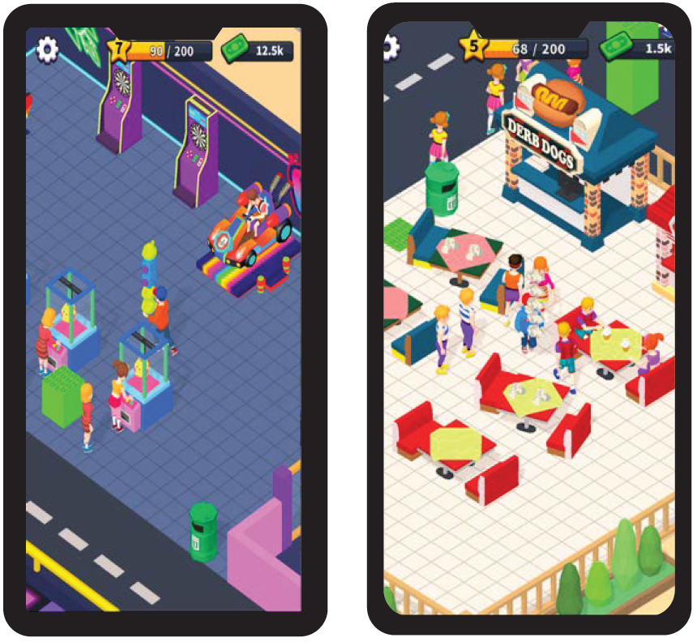
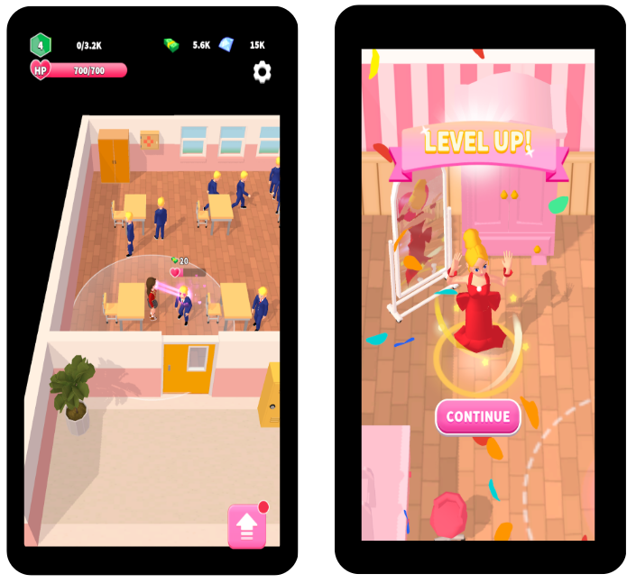

# 이수민 | Software Developer

---

## 👋 About Me

> 상용 소프트웨어 개발 경험을 바탕으로 클라이언트 개발부터 엔진·플랫폼, 빌드·배포 자동화까지 경험의 범위를 넓혀온 개발자입니다.

> Unity 기반 모바일 게임 4종의 개발, 출시, 유지보수에 참여하며
> 게임플레이와 UI뿐 아니라 데이터 구조, 저장 시스템, 비동기 처리, 성능 최적화,
> 외부 SDK/API 연동, Android/iOS 빌드 및 출시 대응까지 클라이언트 개발 전반을 경험했습니다.

> 이후 Unreal Engine 기반 엔진·플랫폼 업무를 수행하며
> Jenkins/Groovy 기반 CI/CD 파이프라인, Python·Batch·PowerShell 기반 자동화,
> 빌드·패키징·배포 환경 운영, 플랫폼 기능 및 외부 서비스 연동,
> 장애 로그 분석과 개발환경 개선 업무를 경험했습니다.

> 반복적으로 발생하는 문제를 사람이 계속 확인하기보다
> 사전에 검증하거나 자동으로 대응할 수 있는 구조를 만드는 데 관심이 있습니다.
> Python 기반 사전 검증 도구와 프로세스 Watchdog을 구현했으며,
> 로컬 LLM을 활용해 빌드 실패 로그의 원인과 관련 영역을 분석하고
> 사내 메신저 API로 전달하는 자동화 기능도 구현했습니다.

> 특정 기술이나 분야에 한정되기보다,
> 시스템의 흐름을 이해하고 안정적인 운영과 지속적인 개선에 기여할 수 있는 개발자를 지향합니다.

📧 Email: [lsm6265@naver.com](mailto:lsm6265@naver.com)

---

## 🧱 Tech Stack

### Languages

 

### Engine / Application

 

### Build / Automation

 

### Data / Service

 

### Version Control / Tools

 

### Development Experience

`Client Development`
`Platform Integration`
`Build / Deployment`
`CI/CD`
`Automation`
`Data Pipeline`
`SDK / API Integration`
`Troubleshooting`
`Performance Optimization`

---

# 💼 Career

## BIGGAME STUDIO | Engine / Platform Developer

> 2026.07 ~ 2026.09

Unreal Engine 기반 프로젝트의 엔진·플랫폼 기능 개발과
빌드·배포 환경 운영 및 자동화 업무를 수행했습니다.

여러 프로젝트와 개발 조직이 사용하는 환경을 지원하며
플랫폼 기능 및 외부 서비스 연동, CI/CD 파이프라인,
반복 업무 자동화, 빌드 장애 분석 및 개발환경 개선을 경험했습니다.

### 주요 담당 업무

- Unreal Engine 기반 엔진·플랫폼 기능 개발 및 유지보수
- 프로젝트 요구사항에 따른 엔진 코드 수정 및 기능 추가
- 로그인·인증·알림 등 플랫폼 공통 기능 개발 및 서비스 연동
- 외부 SDK/API 연동 및 플랫폼별 이슈 대응
- 게임 클라이언트 빌드·패키징·배포 프로세스 개발 및 운영
- Jenkins / Groovy / Jenkinsfile 기반 CI/CD Pipeline 관리 및 개선
- Python / Batch / PowerShell 기반 반복 업무 및 빌드 자동화
- Windows / macOS 환경의 빌드 및 플랫폼 이슈 대응
- Git / SVN 기반 프로젝트 및 빌드 리소스 관리
- 빌드 실패 로그 분석 및 장애 원인 추적

### 운영 / 자동화 개선 경험

- Python 기반 리소스 의존성 사전 검증 프로그램 구현
  - 작업자가 변경사항을 저장소에 반영하기 전에 리소스 간 의존성 문제를 직접 확인할 수 있도록 구성
  - 실제 쿠킹 및 빌드 단계까지 문제가 넘어가기 전에 오류 파일을 사전에 확인할 수 있도록 개선

- 빌드 머신 Watchdog 구현
  - 빌드에 필요한 터미널 프로세스의 상태를 감시
  - 비정상 종료 시 프로세스를 자동으로 다시 실행하도록 구성

- 로컬 LLM 기반 빌드 오류 분석 자동화
  - 빌드 실패 로그에서 주요 오류와 관련 영역을 분석 및 분류
  - 필요한 로그를 선별하고 분류 기준을 조정하여 불필요한 분석을 줄임
  - 분석 결과를 사내 메신저 API와 연동하여 관련 담당자가 원인과 확인 영역을 파악할 수 있도록 구성

---

## ALBUS Corp | Unity Client Developer

> 2023.09 ~ 2025.02 (1년 6개월)

Unity 기반 모바일 게임 4종의 초기 개발부터 출시 및 유지보수까지 참여했습니다.

게임플레이 기능뿐 아니라 데이터 구조, 저장 시스템, 비동기 처리,
성능 최적화, 외부 SDK/API 연동, 데이터 파이프라인,
Android/iOS 빌드와 스토어 출시 대응까지 클라이언트 개발 전반을 담당했습니다.

### 주요 담당 업무

- 상용 모바일 게임 4종 개발·출시·유지보수
- JSON 기반 저장 시스템 및 게임 데이터 구조 설계
- 저장 데이터 버전 관리 및 기존 사용자 데이터 보정 처리
- Google Sheet 기반 데이터 파이프라인 구축
- Google Sheet → ScriptableObject / JSON 데이터 변환 자동화
- Firebase 및 광고·분석 등 외부 SDK 연동
- Android / iOS 빌드 및 Google Play / App Store 출시 대응
- UniTask / async·await 기반 비동기 처리 구조 구현
- 게임플레이 로직, NPC 행동 및 상호작용 시스템 개발
- UGUI 기반 인게임 UI 및 팝업 UI 구현
- Object Pool / Component Pool / LOD / Occlusion Culling 기반 성능 최적화
- 플랫폼별 SDK 설정 및 연동 이슈 대응

<strong>ALBUS 세부 구현 경험 보기</strong>

### Data / Save

- JSON 기반 저장 구조 설계
- 데이터 버전 정보를 기반으로 포맷 변경 대응
- 기존 사용자 로컬 데이터에 신규 필드 및 기본값 적용
- 데이터 구조 변경 시 버전별 보정 로직 구현
- 저장 및 로드 과정의 데이터 정합성 검증 및 보정 처리

### Data Pipeline

- Google Sheet에서 관리되는 데이터를 개발 환경으로 가져오는 구조 구현
- 데이터를 ScriptableObject / JSON 형태로 변환해 사용할 수 있도록 자동화
- 기획 데이터와 실제 게임 데이터가 동일한 원본을 기준으로 관리될 수 있도록 구성

### Async / Initialization

- UniTask 및 async/await 기반 비동기 초기화 흐름 구현
- 저장 데이터 로드, 시스템 초기화, UI 갱신 등의 처리 순서 구성
- 마지막 접속 시간을 기준으로 오프라인 보상 계산 로직 구현

### SDK / Platform / Build

- Firebase 기반 사용자 행동 데이터 수집 환경 구축
- 광고 및 외부 SDK 연동
- 플랫폼별 SDK 설정 및 연동 이슈 대응
- Android / iOS 빌드 대응
- Google Play / App Store 출시 과정의 빌드 및 플랫폼 이슈 대응

### Gameplay / UI

- NPC 이동 및 행동 패턴 로직 구현
- 이벤트 트리거 기반 상호작용 시스템 구현
- 탑승, 생산, 보상 등 게임 루프와 연결되는 상호작용 기능 개발
- UGUI 기반 인게임 UI 및 팝업 UI 구현
- 재화, 보상, 업그레이드, 진행 상태 UI 구현
- 게임 상태 변화에 따른 이벤트 기반 UI 갱신 구조 적용

### Optimization

- 100명 이상 NPC 동시 처리 구조 설계 및 최적화
- Object Pool 및 Component Pool 적용
- 반복적인 객체 생성 및 GC 부담 감소
- LOD / Occlusion Culling 기반 렌더링 최적화
- 불필요한 Update 및 컴포넌트 활성화 비용 감소

---

# 🛠 Projects

## 📦 Commercial Products

> Unity 기반 모바일 게임 4종의 초기 개발부터 출시 및 유지보수까지 참여했습니다.
> 데이터 구조, 게임플레이, UI, 성능 최적화, SDK/API 연동,
> Android/iOS 빌드 및 스토어 출시 대응을 담당했습니다.

| 썸네일 | 게임명 | 장르 | Google Play | App Store |
|---|---|---|---|---|
|  | WaterParkBoys | Hyper Casual / Simulation | [바로가기](https://play.google.com/store/apps/details?id=com.Albus.WaterParkBoys) | [바로가기](https://apps.apple.com/us/app/waterpark-boys/id6457257165) |
|  | AwesomePark | Hyper Casual / Simulation | [바로가기](https://play.google.com/store/apps/details?id=com.Albus.AwesomePark) | [바로가기](https://apps.apple.com/kr/app/awesome-park-idle-game/id6482050793) |
|  | Roller Disco | Hyper Casual / Simulation | [바로가기](https://play.google.com/store/apps/details?id=com.albus.newrollerdisco) | [바로가기](https://apps.apple.com/us/app/skate-shop-roller-disco-dance/id6744957869) |
|  | MakeAQueen | Hyper Casual / Action | [바로가기](https://play.google.com/store/apps/details?id=com.Albus.MakeAQueens) | - |

---

## 📁 Other Projects

| 프로젝트 | 분야 | 주요 기술 / 경험 | 링크 |
|---|---|---|---|
| Project MORPG | Client / Server | C++ TCP Server · MariaDB · Packet Processing · Repository Pattern · Client/Server Separation | [GitHub](https://github.com/HaloTwo/Project_MORPG) |
| Lies of P | Unreal / C++ | GAS · Data-Driven Architecture · Gameplay System · Behavior Tree / EQS | [GitHub](https://github.com/HaloTwo/LOP) / [영상](https://youtu.be/6_0rvUXyf8w) |
| Crimson Slash | Unity / C# | Event-driven Combat · Input System · Object Pool · System Separation | [GitHub](https://github.com/HaloTwo/2DCombatProject) / [영상](https://youtu.be/WMT9xRD1Y8A) |

<strong>주요 프로젝트 상세 보기</strong>

---

## Project MORPG

> Unity 클라이언트와 C++ TCP 서버를 분리하여
> 클라이언트/서버 통신과 데이터 영속화 구조를 학습한 프로젝트입니다.

클라이언트가 계정 및 캐릭터 데이터를 직접 판단하지 않고
C++ 서버가 인증, 캐릭터 생성·삭제, 게임 입장,
원격 플레이어 동기화 흐름을 처리하도록 구성했습니다.

- **기간:** 2026.05 ~ 진행 중
- **기술:** Unity 6 · C# · C++17 · Winsock TCP Server · MariaDB
- **핵심:** Client/Server Separation · Packet Processing · DB Persistence · Multiplayer Synchronization

### 구현 내용

- LoginScene → LoadingScene → CharacterSelectScene → GameScene 흐름 구성
- Unity TCP Client와 C++ Winsock TCP Server 연결
- 텍스트 프로토콜 기반 요청/응답 패킷 처리
- NetworkManager / TcpServerConnection / PacketDispatcher 구조 분리
- TcpServer / ClientSession / PacketCodec / AuthService 구조 구현
- Repository Pattern 기반 MariaDB 접근 구조 구성
- 로그인 / 회원가입 / 캐릭터 생성 / 캐릭터 삭제 / 게임 입장 흐름 구현
- 계정당 캐릭터 3슬롯 구조와 `slot_index` 기반 슬롯 유지 처리
- 두 클라이언트 접속 시 원격 플레이어 Spawn / Move / Stop / Despawn 동기화
- 인게임 채팅 UI 및 TCP 채팅 송수신 흐름 구현

### 구현 방향

- Unity 클라이언트가 DB에 직접 접근하지 않고 서버를 통해 계정 및 캐릭터 데이터를 처리하도록 분리
- 네트워크 연결, 패킷 처리, 서비스 계층, Repository 계층을 나누어 각 역할을 분리
- 초기에는 Blocking TCP와 Text Protocol을 사용하되 추후 구조 확장이 가능하도록 구성

---

## Lies of P

> Unreal Engine 5 / C++ 기반 액션 RPG 개인 프로젝트입니다.
> Gameplay Ability System, 전투 판정, 타겟팅, AI,
> 데이터 기반 구조를 중심으로 게임 시스템을 구현했습니다.

- **기간:** 2025.07 ~ 2025.09
- **기술:** Unreal Engine 5 · C++ · Blueprint · GAS · Behavior Tree · EQS
- **핵심:** Gameplay Architecture · GAS · Targeting · AI · Data-Driven Structure

### 구현 내용

- Gameplay Ability System 기반 Ability / Effect / Attribute / Tag 구조 설계
- Ability 단위로 공격, 회피, 락온, 피격 등 기능 분리
- Weapon Trace 기반 공격 판정 구현
- 이전 위치와 현재 위치 사이를 Trace하여 빠른 애니메이션의 판정 누락 보완
- Lock-On 대상 탐색 및 카메라·이동 처리
- Behavior Tree + EQS 기반 적 탐색 및 전투 AI 구현
- Boss HP 조건에 따른 Phase 전환 및 패턴 구조 구현
- Motion Warping과 Anim Notify를 활용한 이동 보정 및 타이밍 처리
- DataAsset 기반 무기 / 스킬 / 패턴 데이터 구조 설계

### 구현 방향

- 기능을 하드코딩하기보다 Ability, GameplayTag, DataAsset을 기준으로 역할 분리
- 새로운 무기, 공격, AI 패턴 추가 시 기존 코드 수정 범위를 줄일 수 있는 구조를 목표로 구현

---

## Crimson Slash

> Unity 6 기반 2D 액션 프로토타입입니다.
> 입력, 전투 판정, 스킬, 웨이브, 피드백, 오브젝트 풀링을
> 각 역할별로 분리해 구현했습니다.

- **기간:** 2026.05.16 ~ 2026.05.20
- **기술:** Unity 6 · C# · New Input System · UGUI · ScriptableObject · Object Pool
- **핵심:** Event-driven System · Combat · Object Pool · System Separation

### 구현 내용

- New Input System 기반 키보드 / 게임패드 입력 처리
- 기본 공격 콤보 및 애니메이션 이벤트 기반 Hitbox 처리
- 대쉬공격, 충격파, 검기, 공중공격 스킬 구현
- 패링 / 가드 시스템 구현
- 투사체 반사, 피격 이펙트, 히트스톱, 카메라 쉐이크, 데미지 텍스트 연동
- 근접 / 원거리 / 비행 / 강한 지상형 적 AI 구성
- 미니보스 및 Wave 진행 구조 구현
- Wave Clear / Game Clear / Game Over UI 흐름 구현
- 투사체, 이펙트, 드랍 아이템, 대쉬 잔상에 Object Pool 적용

### 구현 방향

- 입력, 이동, 전투 판정, 체력, 피드백, UI의 역할 분리
- 애니메이션 이벤트를 통해 실제 타격 프레임과 판정 시점 연결
- 반복 생성되는 객체를 Pooling하여 불필요한 생성/해제 비용 감소

---

<strong>기타 프로젝트 보기</strong>

| 프로젝트 | 엔진 | 분야 | 핵심 구현 | 링크 |
|---|---|---|---|---|
| WildTamer | Unity 6 | 2D RPG | Group AI · Auto Combat · Object Pool · Minimap Fog | [GitHub](https://github.com/HaloTwo/WildTamer) / [영상](https://youtube.com/shorts/mLd9Y7k4bvM) |
| Pokemon: Scarlet | Unity | 3D RPG | State Pattern · Enemy AI · Data Structure · Turn-based Combat | [GitHub](https://github.com/HaloTwo/Pokemon) / [영상](https://www.youtube.com/watch?v=s__GzKLjPf0) |
| Nier: Automata | Unity | 3D Action RPG | State Machine · Enemy AI · Boss Pattern · Combat Flow | [GitHub](https://github.com/HaloTwo/Nier-Automata) / [영상](https://www.youtube.com/watch?v=h8MQ959f8tk) |
| Cuphead | Unity | 2D Action | Boss Pattern · Coroutine · Projectile · Object Pool | [GitHub](https://github.com/HaloTwo/Cuphead) / [영상](https://www.youtube.com/watch?v=5bR0k2nC6nk) |

---

# 🎓 Education

### 경일게임아카데미

**Unity 게임 프로그래밍 양성과정 수료**  
2023.03 ~ 2023.08

- C# 및 객체지향 프로그래밍
- Unity 기반 2D / 3D 애플리케이션 개발
- 데이터 저장 및 관리
- UI, 비동기 처리, 디버깅 및 성능 최적화
- 개인 및 팀 프로젝트 수행
- Git 기반 협업 경험

### 한림대학교

**소프트웨어융합스쿨 콘텐츠IT학과 졸업**  
2019.03 ~ 2023.02

### 한림성심대학교

**디지털미디어콘텐츠과 졸업**  
2017.03 ~ 2019.02
